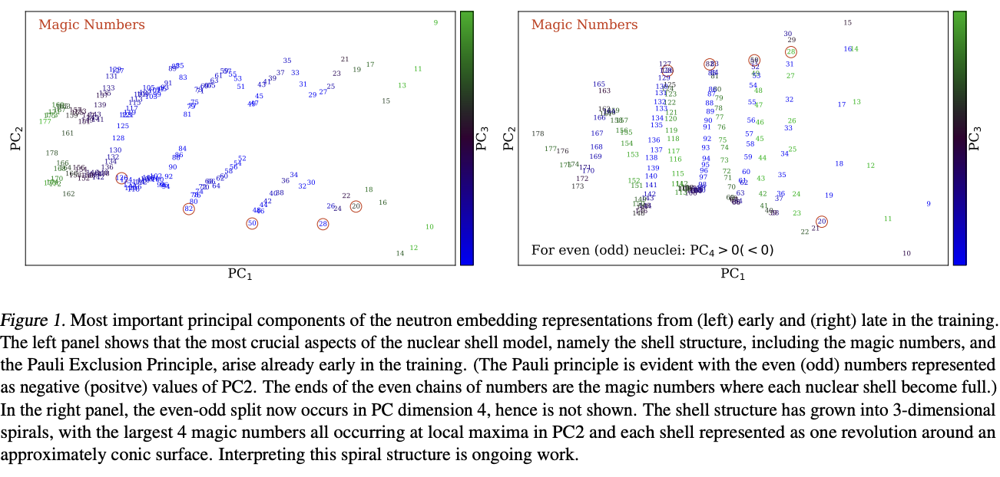

# Mechanistic Interpretability of NuCLR

[NuCLR](https://arxiv.org/pdf/2306.06099.pdf) has the ability to predict many nuclear properties with high accuracy. It can generalize well across tasks, which indicates that it possibly has learned something about physics. An initial investigation shows that the model has learned some of the basics of nuclear theory, including the Pauli Exclusion principle and various magic numbers. Furthermore, it has an interesting spiral structure in the embeddings of neutrons and protons. But can we fully describe how the model can achieve the performance it does? The aim of this project is to fully reverse-engineer the algorithm NuCLR uses and, possibly, derive new nuclear physics understanding from it.

Here are **very rough ideas for things to try:**

1. Look at the embeddings very carefully and systematically. 
    - Study the different dimensions and what they are responsible for. Are they highly entangled, or are different dimensions responsible for different concepts? (In the paper, we find  PCA 4 to be responsible for parity).
    - Employ dimensionality reduction techniques like PCA, T-SNE or transforms like Fourrier to derive understanding.
    - How do the N and Z embeddings combine with a task to give a “nucleus embedding”? What does that look like for different nuclei? Isotopic chains? Isotonic chains?
    - Can we find a symbolic formula for the embeddings of N and Z? How about the nucleus embedding?
2. Understand the binding energy (BE) function.
    - What is the function f(N, Z) = BE? N and Z embeddings are clearly highly dimensional, but the underlying function should be low dimensional. Can we describe this function in any way? Is it modular? Can we find the “highest-order terms” (maybe different additive pieces with decreasing importance)?
    - What is this spiral structure, and how do go from the spiral to a prediction?
3. There’s a lot of work on Mechanistic Interpretability that could be interesting. [Neel Nanda](https://www.neelnanda.io/mechanistic-interpretability) has a series of videos/posts for Interp for Transformers that I recommend looking at. There’s also work concerning neuron level interp, occlusion tests, saliency maps, etc. Anthropic has a [Transformer Circuits Blog](https://transformer-circuits.pub/2022/mech-interp-essay/index.html), but that’s not exactly what we use here (the blogs are nice to understand how people approach this problem on larger scales). 
4. Revisiting training to make things interpretable by design. Use various tricks like [SoLU activation](https://transformer-circuits.pub/2022/solu/index.html), compositional architecture (RNN?), [local neurons](https://arxiv.org/pdf/2305.08746.pdf), effective dimension regularization, etc.




## Getting Started
The scripts can be run in the following way:
```
python -m scripts.pipeline --exp <experiment_name> --train --plot
```
Running as a Python module ensures that the paths are set correctly and `lib` can be loaded correctly. 
The `--exp` flag specifies the experiment name, which is used to create a folder in `experiments/` to store the results. 
The `--train` flag specifies that the model should be trained. The `--plot` flag specifies that the results should be plotted.
